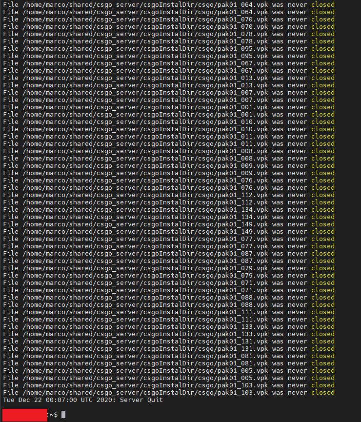

# CS:GO Server

How to create a CS:GO Server on Ubuntu 18 x64

## Requirements

* OS: [Ubuntu Server 18.04](https://releases.ubuntu.com/18.04/ubuntu-18.04.5-live-server-amd64.iso)
* CPU: Intel Core Duo E6600 (2-2.8GHz+) or AMD Phenom X3 8750+
* RAM: 2GB+
* HDD: 30GB+
* [Steam Game Server Login Token (GSLT)](https://developer.valvesoftware.com/wiki/Counter-Strike:_Global_Offensive_Dedicated_Servers)
* [Steam Web API Key](https://developer.valvesoftware.com/wiki/CSGO_Workshop_For_Server_Operators)

## Install CS:GO Dedicated Server

To install the CS:GO server type the following commands in your terminal and follow the instructions on the screen.
~~~~
 $ sudo add-apt-repository multiverse
 $ sudo dpkg --add-architecture i386
 $ sudo apt update
 $ sudo apt install lib32gcc1 steamcmd 
 $ mkdir /path/to/csgoInstalDir
~~~~
Once the installation is completed copy the "startServer.sh" script on you Ubuntu machine, open it in edit mode and set the value of the properties:
~~~~
STEAM_CSGO_KEY=                 # Your Steam GSLT
STEAM_API_KEY=                  # Your Steam Web API Key
CSGO_INSTALL_FOLDER_FOLDER=     # /path/to/csgoInstalDir
MAP_GROUP=                      # The map group name to use at start up
MAP_START=                      # The map name to run at start up
HOST_IP=                        # The IP of you machine
~~~~

After editing the "startServer.sh" script, make it executable and run it.
~~~~
# Make the script executable
$ chmod +x /path/to/the/startServer.sh

# Exucute the script
$ /path/to/the/startServer.sh
~~~~

The script will start to download CS:GO and it might take a while. It depends on your internet connections.

## Stop the server

One the process is completed you can stop the server by pressing "ctrl+c"

Now you can start to edit the CS:GO configuration files accorting to your needs

## Configuration

There are multiple files that you can create or upadate to set your configuration. In my case I wanted to customise the game mode "Competitive" configuration.
Files:
* serverDir/GameModes_Server.txt -> Here is were I have defined my map groups.
* serverDir/subscribed_collection_ids.txt -> Currently is empty, but here I can put the ID of a workshop collection that I subscribed.
* serverDir/subscribed_file_ids.txt -> Here I put the list of IDs of the workshop maps that I subscribed.
* serverDir/csgo/autoexec.cfg -> I provided the Server config, like name, password.
* serverDir/csgo/gamemode_competitive_server.cfg -> Here is where I override the Competitive mode configuration.
* [List of CS:GO Cvars](https://developer.valvesoftware.com/wiki/List_of_CS:GO_Cvars)

## Connect to rcon

From the CS console

~~~~
$ rcon_password password_of_you_rcon
$ rcon command_to_execute
~~~~

## Some commands

- rcon map workshop/2311360577/de_mirage_cyberpunk
- rcon mapgroup [MAP_GROUP_NAME] # It changes the map group
- rcon bot_kick # Kicks all the bots
- rcon changelevel de_shortdust # It changes the level
- rcon bot_add_t # Add Bot to Terrorist team
- rcon bot_add_ct # Add Bot to Counter Terrorist team
- rcon bot_stop 1 # Stops the bots, they will stand still and do nothing.
- rcon bot_mimic 1 # Bots will mimic your movements and actions, bot_mimic 0 to turn off again.

## Map Groups

* mg_ixi_workshop
    * [as_oilrig_b1](https://steamcommunity.com/sharedfiles/filedetails/?id=165683043)
    * [as_tundra](https://steamcommunity.com/sharedfiles/filedetails/?id=1820772401)
    * [cs_backalley](https://steamcommunity.com/sharedfiles/filedetails/?id=125786610)
    * [cs_bank](https://steamcommunity.com/sharedfiles/filedetails/?id=129042069)
    * [cs_cruise](https://steamcommunity.com/sharedfiles/filedetails/?id=600914785)
    * [cs_estate](https://steamcommunity.com/sharedfiles/filedetails/?id=135827566)
    * [cs_hijack](https://steamcommunity.com/sharedfiles/filedetails/?id=273415773)
    * [cs_museum](https://steamcommunity.com/sharedfiles/filedetails/?id=127012360)
    * [cs_valley](https://steamcommunity.com/sharedfiles/filedetails/?id=206678373)
    * [de_aqueduct](https://steamcommunity.com/sharedfiles/filedetails/?id=600728667)
    * [de_arcade_v2](https://steamcommunity.com/sharedfiles/filedetails/?id=320674385)
    * [de_aztec](https://steamcommunity.com/sharedfiles/filedetails/?id=1561348377)
    * [de_beerhouse](https://steamcommunity.com/sharedfiles/filedetails/?id=1302060184)
    * [de_blast_beta02](https://steamcommunity.com/sharedfiles/filedetails/?id=529733812)
    * [de_blossom](https://steamcommunity.com/sharedfiles/filedetails/?id=2011784264)
    * [de_breach](https://steamcommunity.com/sharedfiles/filedetails/?id=1258599704)
    * [de_Codewise2](https://steamcommunity.com/sharedfiles/filedetails/?id=874801875)
    * [de_coldwater](https://steamcommunity.com/sharedfiles/filedetails/?id=215971897)
    * [de_cornerwork](https://steamcommunity.com/sharedfiles/filedetails/?id=1414531578)
    * [de_crown](https://steamcommunity.com/sharedfiles/filedetails/?id=239672577)
    * [de_dst](https://steamcommunity.com/sharedfiles/filedetails/?id=1387732091)
    * [de_engage](https://steamcommunity.com/sharedfiles/filedetails/?id=2175304484)
    * [de_fire](https://steamcommunity.com/sharedfiles/filedetails/?id=401145257)
    * [de_firenze](https://steamcommunity.com/sharedfiles/filedetails/?id=2105680462)
    * [de_garrison](https://steamcommunity.com/sharedfiles/filedetails/?id=599577239)
    * [de_inferno_winter](https://steamcommunity.com/sharedfiles/filedetails/?id=570181108)
    * [de_marine](https://steamcommunity.com/sharedfiles/filedetails/?id=1958745897)
    * [de_marquis](https://steamcommunity.com/sharedfiles/filedetails/?id=221603249)
    * [de_miracle](https://steamcommunity.com/sharedfiles/filedetails/?id=2064064363)
    * [de_mirage_cyberpunk](https://steamcommunity.com/sharedfiles/filedetails/?id=2311360577)
    * [de_mutiny](https://steamcommunity.com/sharedfiles/filedetails/?id=1978052734)
    * [de_pyramid](https://steamcommunity.com/sharedfiles/filedetails/?id=1587622126)
    * [de_santorini](https://steamcommunity.com/sharedfiles/filedetails/?id=546623875)
    * [de_subzero](https://steamcommunity.com/sharedfiles/filedetails/?id=1318698056)
    * [de_westwood2](https://steamcommunity.com/sharedfiles/filedetails/?id=862889198)
    * [de_zenith](https://steamcommunity.com/sharedfiles/filedetails/?id=1855652898)
    * [de_zoo](https://steamcommunity.com/sharedfiles/filedetails/?id=389175812)
    * [fy_simpsons](https://steamcommunity.com/sharedfiles/filedetails/?id=523638720)
* mg_ixi_short
    * de_shortnuke
    * de_shortdust
    * de_shorttrain
    * workshop\129042069\cs_bank
    * de_lake
    * de_safehouse
    * de_stmarc
    * workshop\523638720\fy_simpsons

* mg_ixi_classic
    * cs_italy
    * cs_assault
    * cs_militia
    * cs_office
    * de_nuke
    * de_train
    * de_cbble
    * de_dust2
    * de_inferno
    * de_lake
    * de_mirage
    * de_overpass
    * de_vertigo

## Workshop Map List

Just copy the command into the rcon console to switch to one of the following maps:

~~~~
rcon map workshop/165683043/as_oilrig_b1
rcon map workshop/1820772401/as_tundra
rcon map workshop/125786610/cs_backalley
rcon map workshop/129042069/cs_bank
rcon map workshop/600914785/cs_cruise
rcon map workshop/135827566/cs_estate
rcon map workshop/273415773/cs_hijack
rcon map workshop/127012360/cs_museum
rcon map workshop/206678373/cs_valley
rcon map workshop/600728667/de_aqueduct
rcon map workshop/320674385/de_arcade_v2
rcon map workshop/1561348377/de_aztec
rcon map workshop/1302060184/de_beerhouse
rcon map workshop/529733812/de_blast_beta02
rcon map workshop/2011784264/de_blossom
rcon map workshop/1258599704/de_breach
rcon map workshop/874801875/de_Codewise2
rcon map workshop/215971897/de_coldwater
rcon map workshop/1414531578/de_cornerwork
rcon map workshop/239672577/de_crown
rcon map workshop/1387732091/de_dst
rcon map workshop/2175304484/de_engage
rcon map workshop/401145257/de_fire
rcon map workshop/2105680462/de_firenze
rcon map workshop/599577239/de_garrison
rcon map workshop/570181108/de_inferno_winter
rcon map workshop/1958745897/de_marine
rcon map workshop/221603249/de_marquis
rcon map workshop/2064064363/de_miracle
rcon map workshop/2311360577/de_mirage_cyberpunk
rcon map workshop/1978052734/de_mutiny
rcon map workshop/1587622126/de_pyramid
rcon map workshop/546623875/de_santorini
rcon map workshop/1318698056/de_subzero
rcon map workshop/862889198/de_westwood2
rcon map workshop/1855652898/de_zenith
rcon map workshop/389175812/de_zoo
rcon map workshop/523638720/fy_simpsons
~~~~
