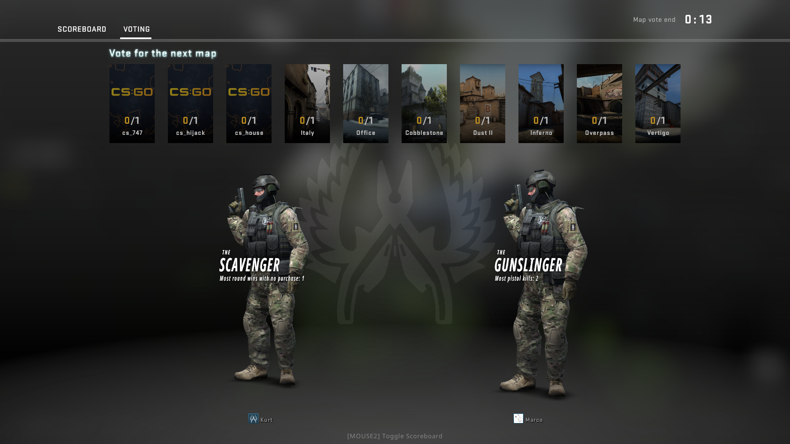
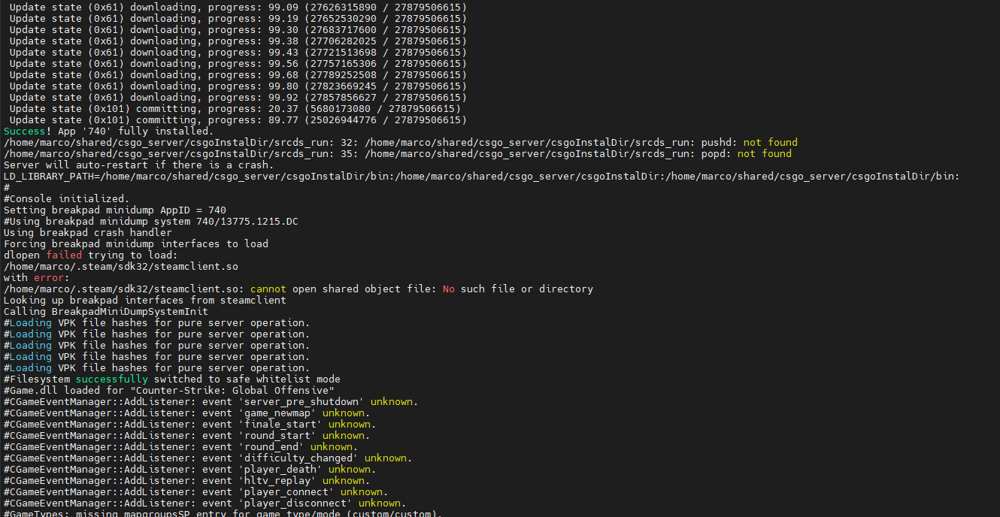
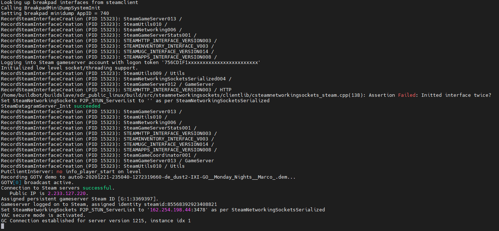

# CS:GO Dedicated Server

How to create a CS:GO Dedicated Server

## Requirements

* OS: [Ubuntu Server 18.04](https://releases.ubuntu.com/18.04/ubuntu-18.04.5-live-server-amd64.iso) or Windows 7+
* CPU: Intel Core Duo E6600 (2-2.8GHz+) or AMD Phenom X3 8750+
* RAM: 2GB+
* HDD: 30GB+
* [Steam Game Server Login Token (GSLT)](https://developer.valvesoftware.com/wiki/Counter-Strike:_Global_Offensive_Dedicated_Servers)
* [Steam Web API Key](https://developer.valvesoftware.com/wiki/CSGO_Workshop_For_Server_Operators)

## Install CS:GO Dedicated Server

### Linux

~~~~
# Clone the repo
$ git clone https://github.com/marcosolina/csgo_server.git

# Remove possible Windows characters
$ sed -i -e 's/\r$//' csgo_server/Linux/installSteam.sh
$ sed -i -e 's/\r$//' csgo_server/Linux/startServer.sh

# Make the scripts executable
$ chmod +x csgo_server/Linux/installSteam.sh
$ chmod +x csgo_server/Linux/startServer.sh

# Instal Steam CMD
$ csgo_server/Linux/installSteam.sh

# Edit the startServer.sh and set the properies below
$ vim csgo_server/Linux/startServer.sh

STEAM_CSGO_KEY=                 # Your Steam GSLT
STEAM_API_KEY=                  # Your Steam Web API Key
CSGO_INSTALL_FOLDER_FOLDER=     # /full/path/to/csgo_server/csgoInstalDir
MAP_GROUP=                      # The map group name to use at start up (Example: mg_active)
MAP_START=                      # The map name to run at start up (Example: de_dust2)
HOST_IP=                        # The IP of you machine (Example: 192.168.1.21)

# Save the script
~~~~

#### Start the server
~~~~
# Just run the "startServer.sh script"
$ csgo_server/Linux/startServer.sh
~~~~

### Windows

* [Download SteamCMD](https://developer.valvesoftware.com/wiki/SteamCMD#Downloading_SteamCMD)
* [Download this Repo](https://github.com/marcosolina/csgo_server/archive/main.zip)
* Extract the files
* Edit the file csgo_server\Windows\startServer.bat and set the following properties
    ~~~~
    set STEAM_CSGO_KEY=                 # Your Steam GSLT
    set STEAM_API_KEY=                  # Your Steam Web API Key
    set CSGO_INSTALL_FOLDER_FOLDER=     # Full path to the csgInstalDir (Example: C:\path\to\csgoInstalDir )
    set PATH_STEAM_CMD=                 # Full path to the SteamCMD exe file (Example: C:\path\to\steamcmd)
    set MAP_GROUP=                      # The map group name to use at start up (Example: mg_active)
    set MAP_START=                      # The map name to run at start up (Example: de_dust2)
    set HOST_IP=                        # The IP of you machine (Example: 192.168.1.21)
    ~~~~
* Double click the startServer.bat to start the server

## CS:GO Configuration

There are multiple files that you can create or upadate to set your configuration.

| File | Usage|
|---|---|
| csgo_server/csgoInstalDir/csgo/cfg/server.cfg | In this file I added the minimal server configuration. Like the host name and the passwords for the server and "rcon" console |
| csgo_server/csgoInstalDir/csgo/cfg/marco.cfg | In this file I provided the server configuration that I want to use in some cases. You can consider this as a "Server Profile Config" |
| csgo_server/csgoInstalDir/csgo/cfg/ixico.cfg | In this file I provided the server configuration that I want to use in other cases. You can consider this as a "Server Profile 2" |
| csgo_server/csgoInstalDir/csgo/GameModes_Server.txt | In this file I define "my custom map groups" |
| csgo_server/csgoInstalDir/csgo/subscribed_collection_ids.txt | In this file I provide ID of the workshop collections that I want to subscribe to |
| csgo_server/csgoInstalDir/csgo/subscribed_file_ids.txt | In this file I provide ID of the workshop maps that I want to subscribe to |

Visit [List of CS:GO Cvars](https://developer.valvesoftware.com/wiki/List_of_CS:GO_Cvars) for a full list of the "server properties" that you can use in:
* server.cfg
* [profile].cfg (Example: marco.cfg, ixico.cfg)

## CS:GO RCON

### Enable the "console" in CS:GO

Start CS:GO and set the following options:

### Use the "RCON"

While playing the game, press "\" to display the console and you start to send commands in this way:

~~~~
$ rcon_password password_of_you_rcon
$ rcon command_to_execute
~~~~

## Some RCON commands

|Command|Description|
|---|---|
| rcon map workshop/2311360577/de_mirage_cyberpunk | It changes the map to workshop/2311360577/de_mirage_cyberpunk |
| rcon changelevel de_shortdust | Another way to change the map |
| rcon mapgroup [MAP_GROUP_NAME] | It changes the map group |
| rcon bot_kick | Kicks all the bots|
| rcon bot_add_t | Add Bot to Terrorist Team |
| rcon bot_add_ct | Add Bot to Counter Terrorist Team |
| rcon bot_stop 1 | Stops the bots, they will stand still and do nothing. |
|rcon bot_mimic 1 | Bots will mimic your movements and actions, bot_mimic 0 to turn off again. |

## My Map Groups

* mg_ixi_workshop
    * [as_oilrig_b1](https://steamcommunity.com/sharedfiles/filedetails/?id=165683043)
    * [as_tundra](https://steamcommunity.com/sharedfiles/filedetails/?id=1820772401)
    * [cs_backalley](https://steamcommunity.com/sharedfiles/filedetails/?id=125786610)
    * [cs_bank](https://steamcommunity.com/sharedfiles/filedetails/?id=129042069)
    * [cs_cruise](https://steamcommunity.com/sharedfiles/filedetails/?id=600914785)
    * [cs_estate](https://steamcommunity.com/sharedfiles/filedetails/?id=135827566)
    * [cs_hijack](https://steamcommunity.com/sharedfiles/filedetails/?id=273415773)
    * [cs_museum](https://steamcommunity.com/sharedfiles/filedetails/?id=127012360)
    * [cs_valley](https://steamcommunity.com/sharedfiles/filedetails/?id=206678373)
    * [de_aqueduct](https://steamcommunity.com/sharedfiles/filedetails/?id=600728667)
    * [de_arcade_v2](https://steamcommunity.com/sharedfiles/filedetails/?id=320674385)
    * [de_aztec](https://steamcommunity.com/sharedfiles/filedetails/?id=1561348377)
    * [de_beerhouse](https://steamcommunity.com/sharedfiles/filedetails/?id=1302060184)
    * [de_blast_beta02](https://steamcommunity.com/sharedfiles/filedetails/?id=529733812)
    * [de_blossom](https://steamcommunity.com/sharedfiles/filedetails/?id=2011784264)
    * [de_breach](https://steamcommunity.com/sharedfiles/filedetails/?id=1258599704)
    * [de_Codewise2](https://steamcommunity.com/sharedfiles/filedetails/?id=874801875)
    * [de_coldwater](https://steamcommunity.com/sharedfiles/filedetails/?id=215971897)
    * [de_cornerwork](https://steamcommunity.com/sharedfiles/filedetails/?id=1414531578)
    * [de_crown](https://steamcommunity.com/sharedfiles/filedetails/?id=239672577)
    * [de_dst](https://steamcommunity.com/sharedfiles/filedetails/?id=1387732091)
    * [de_engage](https://steamcommunity.com/sharedfiles/filedetails/?id=2175304484)
    * [de_fire](https://steamcommunity.com/sharedfiles/filedetails/?id=401145257)
    * [de_firenze](https://steamcommunity.com/sharedfiles/filedetails/?id=2105680462)
    * [de_garrison](https://steamcommunity.com/sharedfiles/filedetails/?id=599577239)
    * [de_inferno_winter](https://steamcommunity.com/sharedfiles/filedetails/?id=570181108)
    * [de_marine](https://steamcommunity.com/sharedfiles/filedetails/?id=1958745897)
    * [de_marquis](https://steamcommunity.com/sharedfiles/filedetails/?id=221603249)
    * [de_miracle](https://steamcommunity.com/sharedfiles/filedetails/?id=2064064363)
    * [de_mirage_cyberpunk](https://steamcommunity.com/sharedfiles/filedetails/?id=2311360577)
    * [de_mutiny](https://steamcommunity.com/sharedfiles/filedetails/?id=1978052734)
    * [de_pyramid](https://steamcommunity.com/sharedfiles/filedetails/?id=1587622126)
    * [de_santorini](https://steamcommunity.com/sharedfiles/filedetails/?id=546623875)
    * [de_subzero](https://steamcommunity.com/sharedfiles/filedetails/?id=1318698056)
    * [de_westwood2](https://steamcommunity.com/sharedfiles/filedetails/?id=862889198)
    * [de_zenith](https://steamcommunity.com/sharedfiles/filedetails/?id=1855652898)
    * [de_zoo](https://steamcommunity.com/sharedfiles/filedetails/?id=389175812)
    * [fy_simpsons](https://steamcommunity.com/sharedfiles/filedetails/?id=523638720)
* mg_ixi_short
    * de_shortnuke
    * de_shortdust
    * de_shorttrain
    * workshop\129042069\cs_bank
    * de_lake
    * de_safehouse
    * de_stmarc
    * workshop\523638720\fy_simpsons

* mg_ixi_classic
    * cs_italy
    * cs_assault
    * cs_militia
    * cs_office
    * de_nuke
    * de_train
    * de_cbble
    * de_dust2
    * de_inferno
    * de_lake
    * de_mirage
    * de_overpass
    * de_vertigo

## Misc

### RCON Copy & Paste

The workshop maps have a very long name. So I created a list of rcon commands that I can easily copy and paste if needed:

~~~~
rcon map workshop/165683043/as_oilrig_b1
rcon map workshop/1820772401/as_tundra
rcon map workshop/125786610/cs_backalley
rcon map workshop/129042069/cs_bank
rcon map workshop/600914785/cs_cruise
rcon map workshop/135827566/cs_estate
rcon map workshop/273415773/cs_hijack
rcon map workshop/127012360/cs_museum
rcon map workshop/206678373/cs_valley
rcon map workshop/600728667/de_aqueduct
rcon map workshop/320674385/de_arcade_v2
rcon map workshop/1561348377/de_aztec
rcon map workshop/1302060184/de_beerhouse
rcon map workshop/529733812/de_blast_beta02
rcon map workshop/2011784264/de_blossom
rcon map workshop/1258599704/de_breach
rcon map workshop/874801875/de_Codewise2
rcon map workshop/215971897/de_coldwater
rcon map workshop/1414531578/de_cornerwork
rcon map workshop/239672577/de_crown
rcon map workshop/1387732091/de_dst
rcon map workshop/2175304484/de_engage
rcon map workshop/401145257/de_fire
rcon map workshop/2105680462/de_firenze
rcon map workshop/599577239/de_garrison
rcon map workshop/570181108/de_inferno_winter
rcon map workshop/1958745897/de_marine
rcon map workshop/221603249/de_marquis
rcon map workshop/2064064363/de_miracle
rcon map workshop/2311360577/de_mirage_cyberpunk
rcon map workshop/1978052734/de_mutiny
rcon map workshop/1587622126/de_pyramid
rcon map workshop/546623875/de_santorini
rcon map workshop/1318698056/de_subzero
rcon map workshop/862889198/de_westwood2
rcon map workshop/1855652898/de_zenith
rcon map workshop/389175812/de_zoo
rcon map workshop/523638720/fy_simpsons
~~~~
